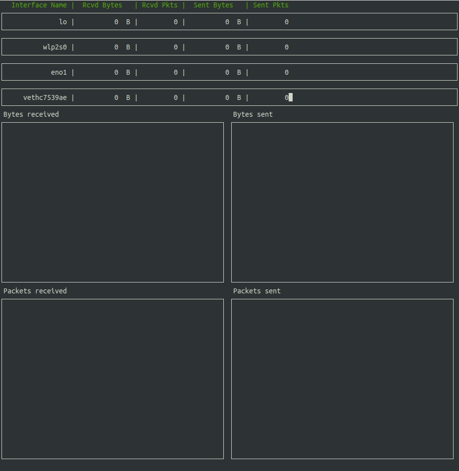
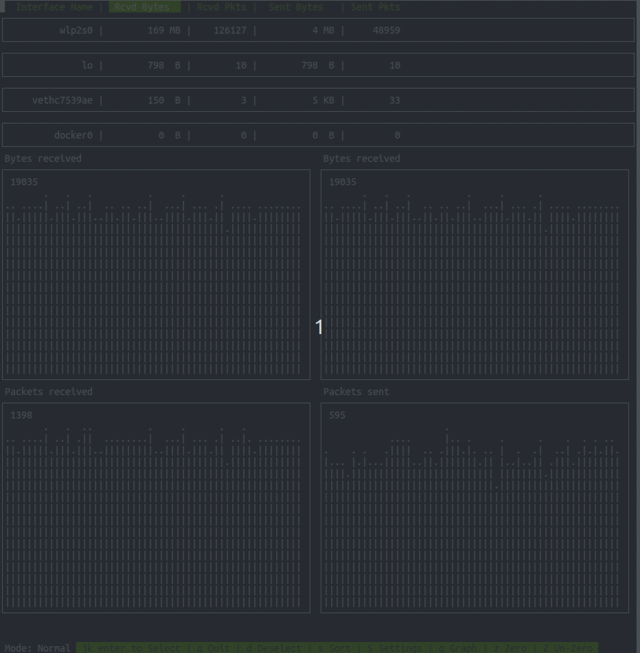

# Bandwidth Monitor
This is a side-project of mine to monitor and visualize network traffic at a high level through each network interface.

## Features
- Interaction through vim-like keybindings
- Hiding of network interfaces that are not desired
- Graphs that normalize based on real-time traffic
- Real-time statistics on network speed through each interface
- Sorting of interfaces based on a data value
- Automatically configured display of graphs based on screen size, resizes with terminal resize

## Interface
)
)
)

